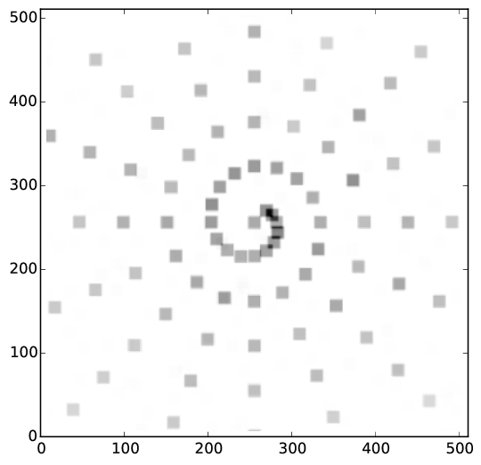

=====================
Detection algorithm
=====================

The detection algorithm consists of two stages. In the first stage a 
list of candidate sources is generated, in the second stage this list 
is vetted for its significance. Both stages rely on poisson statistics.

Stage 1
----------

* The detected counts are smoothed with a convolution with a 7x7 pixel box.
* A background map is created by combining for each pixel the neighboring boxes.
  A 5x5 grid of boxes is considered, for each of those the number of counts 
  computed. The center box is ignored. A biased estimator is used (cutting
  the boxes with most counts) to compute a typical background count rate.
* The significance of each pixel is computed using the poisson distribution.
  Pixels with p<1e-3 are marked as candidate sources.

	
	Image of counts

	
	Box-smoothed image

	
	Background map

	
	Significance map

	

Stage 2
----------

* The candidate pixels are masked and a new background map is computed, same
  as above.
* Each candidate pixel is considered in turn, with higher significance pixels 
  first. A box of 9x9 pixels centered there is considered. The centroid is 
  computed and the position updated, if necessary, up to 3 times.
  Then the poisson probability, considering the new background map is computed.
  Sources with p<1e5 are considered detected. This provides a low fraction of false sources,
  but remains sensitive down to few (6) counts.
  The counts from detected sources are removed from the image, and not 
  considered when handling the next candidate pixel.

	
	Updated background map

	
	Image of counts, with source detections marked.

Source extraction
------------------

Finally at each position a source is extracted. Annuli of radius 0-4, 8-16
are used to extract source and background spectra into .pi files.

	
	Spectrum in Xspec.

